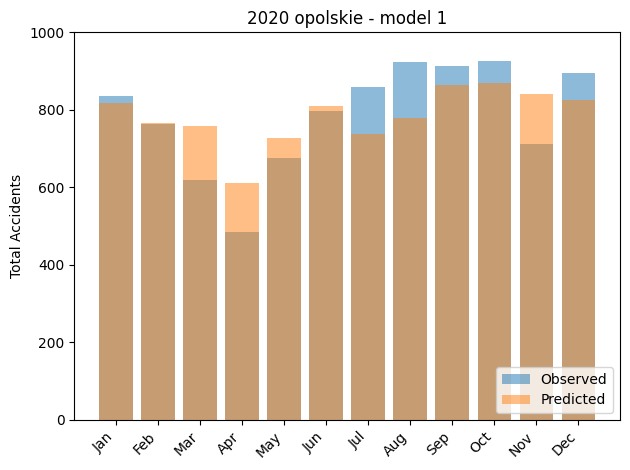
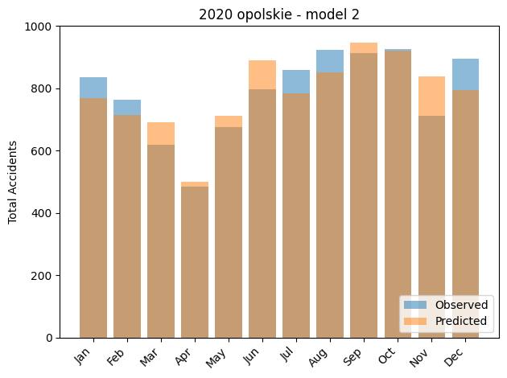

## Bayesian approach to traffic incident prediction

This project focuses on developing a Bayesian model to predict traffic incident counts based on weather data. The objective was to generate monthly predictions at the voivodeship level in Poland.

### Table of Contents
  - [Project overview](#project-overview)
  - [Data](#data)
  - [Models](#models)
  - [Findings](#findings)
  - [Reproducibility](#reproducibility)

### Project overview
``` 
├── data
│   ├── input                  # raw input data
│   │   ├── incidents          # monthly traffic incident data
│   │   ├── voivodeships       # statistical data for Polish voivodeships
│   │   └── weather            # weather data
│   ├── intermediate           # data in consecutive stages of preprocessing
│   └── analysis               # processed data used for models
├── scripts
│   ├── scraping               # scripts for scraping web data from SEWIK and IMGW
│   ├── processing             # scripts for data preprocessing
│   ├── stan                   # Stan model files
│   └── utils                  # report utilities
├── report.ipynb               # final report
└── slides.html                # project presentation slides
```

### Data
The data used in this project included:
- **Traffic incidents data** sourced from SEWIK  _(System Ewidencji Wypadków i Kolizji)_, covering total incidents per voivodeship per month.
- **Voivodeship data** collected from GUS _(Główny Urząd Statystyczny)_, including population, vehicles count and roads length.
- **Weather data** collected from IMGW _(Instytut Meteorologii i Gospodarki Wodnej)_, with representative stations chosen for each voivodeship.

### Models
We used two Poisson models.
* based on humidity $h$ 
$$ y \sim \text{Poisson}(a \cdot h) $$
$$ a \sim \text{Normal}(\mu_{a}, \sigma_{a})$$

* based on humidity $h$ and temperature $t$ with a constant
$$ y \sim \text{Poisson}(a \cdot h + b \cdot t + c) $$
$$ a \sim \text{Normal}(\mu_{a}, \sigma_{a})$$
$$ b \sim \text{Normal}(\mu_{b}, \sigma_{b})$$
$$ c \sim \text{Normal}(\mu_{c}, \sigma_{c})$$

### Findings
Based on our analysis using both PSIS-LOO and WAIC criteria, the second model demonstrates superior predictive performance. However, it's worth noting that the difference in performance between the two models is relatively small.

<div style="display: flex; justify-content: space-around; margin-bottom: 20px;">
    
    
</div>

Our work suggests that humidity is indeed a strong predictor of traffic incident counts, and the addition of temperature and a constant term provides minor improvements.

### Reproducibility
To reproduce our work, please follow the steps below:

1. Clone this repo.
2. Build a Docker image based on the provided Dockerfile.
3. Run the container with the `./data` dir mounted as volume at `/project/data`
4. Attach to the container and run `report.ipynb`

or using the Visual Studio Code Dev Containers extension:

1. Clone this repo.
2. Open the repo in VSCode.
3. Use the _Dev Containers: Rebuild and Reopen in Container_ command.
4. Run `report.ipynb`
